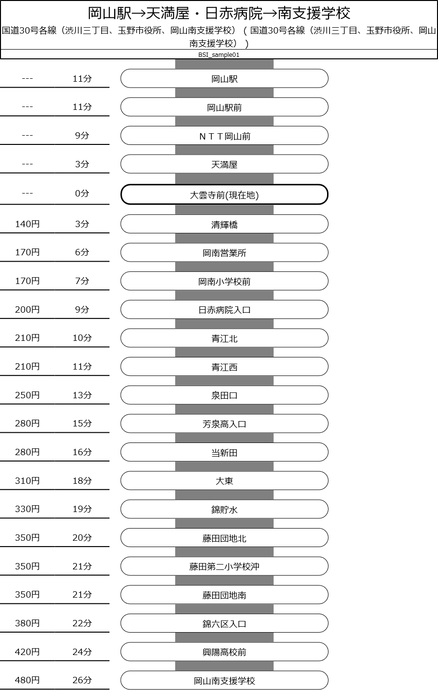

# 卒業研究
このリポジトリは、私が2020年度の卒業研究として取り組んだ一環で作成されたものです。

## 研究名称
***「標準的なバス情報フォーマットを用いたバス停向けバス運行系統図描画システムの構築」***

---------------------------------------------

# 概要
データベースを用いて、GTFS-JPデータからバス停向けの系統路線図を出力するシステム

## サーバーサイド
- nodejs
- mongoDB
- express.js
- mongoose
- nodeGTFS

## クライアントサイド
- vue.js
- html2canvas
- pdfmake

---------------------------------------------
# 想定利用
- 対象：バス事業者
- 利用の見込まれにくいバス停への運行系統図の掲示に
- 簡便なものでも、安く簡単に作成できるなら効果あり？

---------------------------------------------
# 使い方
1. mongoDB, nodejsを用意
1. githubからこのリポジトリをclone
1. cd (cloneしたこのリポジトリの絶対パス)
1. npm install
1. docフォルダ内にあるgtfsImport.jsを実行
    - npm (gtfsImport.jsの絶対パス)
1. npm start
1. localhost:3000などでアクセスできる

---------------------------------------------

# できたこと
- 単一系統での運行系統図の描画
- 描画内容のPDF化

---------------------------------------------

# 出来なかったこと
- できれば複数系統にも対応したかった
- 一括出力
    - バス停ごとで全系統一括出力など
- html2canvas起因のバグの解消
    - 描画がずれる
- 出力されるjsonの構造の改良
    - 現状だと間違いなくまずい
- エラー対策
    - catch関連未対応
    - DBへの脆弱性も不安、きっとある

---------------------------------------------
# 出来上がり例

---------------------------------------------

# 現状
卒業論文内でも指摘した事項
1. API速度に難あり
1. 描画項目の精査やデザインの改良
    - もう少し良いデザインにしたい
    - 利用効果の検証が出来ていない
    - そもそも凡例がない
1. html2canvasを用いたことによるPDF化の限界
    - 独自レンダリングの為、対応cssに限りが
1. ソフト的な面
    - このシステムをどう活用するか
    - バス事業者はnodejs使えない
    - 外部サービスにはお金が、など
1. ライブラリがGTFS-JP対応外
    - これも重要、XXXX_jp.txtは使えない
    - 本当に活用を目指すなら、データベースを捨てて外部APIが無難

---------------------------------------------
# Licence
システムの著作権は作成者である私にあります。現時点ではオープンライセンスではありません。
